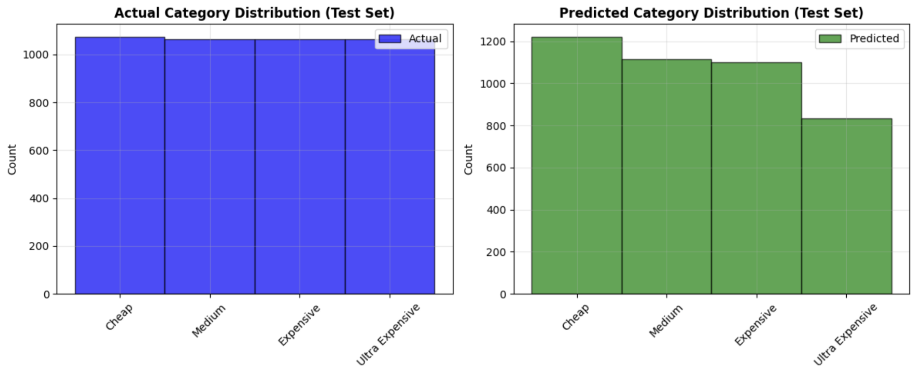
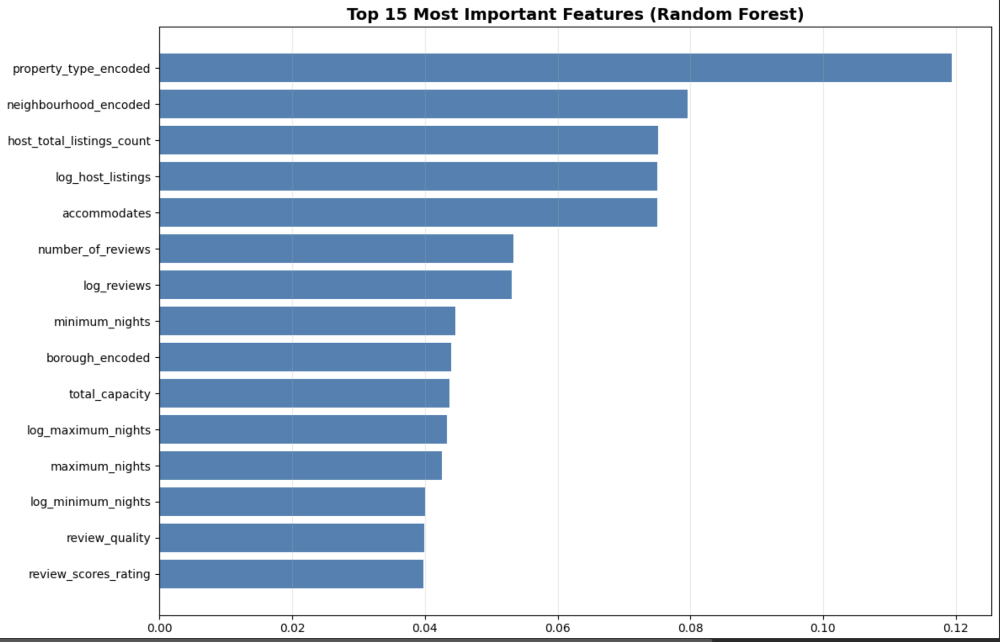
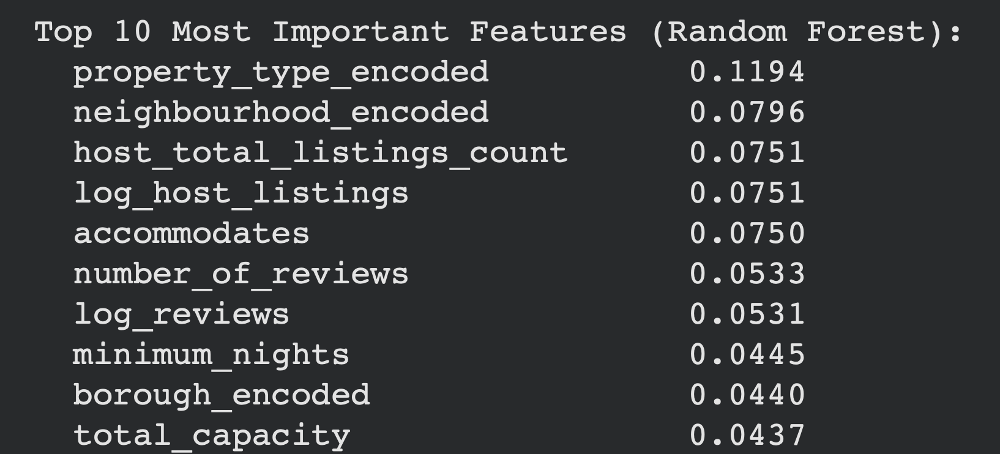
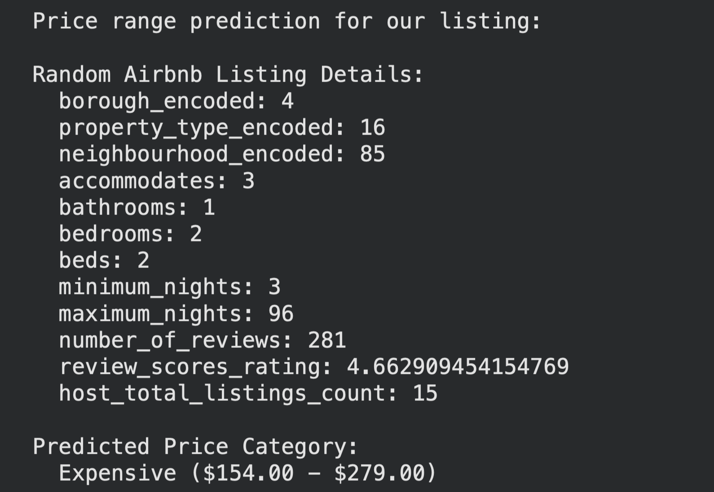

# Final_DataBootcamp
# Airbnb Price Predictor Model	                     
**Sampreet Bheemireddy and Vihan Agarwal**

**Project Overview:**
For our predictive model final project, we wanted to explore how to predict how Airbnb listings within New York City are priced. The purpose of this project was to be able to create a model that predicts the nightly price off of these listings, based on both categorical and numerical features. This makes the project and the model quite complex, because factors like location within New York city may play a larger role in determining the price of the listing than the number of bathrooms or bedrooms. Also, even within different boroughs within New York City, such as Manhattan, property prices vary greatly based on individual neighborhoods. So this means that there is great variance across the boroughs within our data set and within the boroughs. Our model is very interesting because it must account for all of these factors and give an accurate estimate of pricing. Due to the overall complexity and number of factors that go into the pricing of an Airbnb listing, we opted to have our model predict the price within certain ranges. We split the ranges in four: “Cheap”, “Medium”, “Expensive”, and “Ultra Expensive” based on quartiles so that there was an actual basis for these ranges rather than a “selected” number. This means that if someone wanted to understand a relative range that they should price their new listing in, they could gain that information from our model. The overall purpose of our model is to give a good idea of price range, in order to price in a way that attracts the optimal amount of consumers and ensures demand is high enough to fill the listing whenever is it available to avoid lost nights of revenue.

**Our Data Source:**
Our data source was from Inside Airbnb which provides data of every listing in major cities across the world. We downloaded, then cleaned, a dataset from their source. This data set includes verbal descriptions of each listing, location, features of the property, information about the reviews of the listing, and even information about the host and all of their other listings and host reviews. The dataset even includes the host’s “about me” section. In order to get the data ready for our model, we cleaned the datasets to only include the columns that we wanted to include in our dataframe. We chose to keep information about the borough, the neighborhood, the property type, reviews, total host listings, then all information about how many people the property could accommodate and all amenities. We believed that this would provide a good sense of how valuable the property is and how much the listing price would be at. Another piece of important information is the minimum number of nights that could be booked, because the longer the minimum stay, the lower the host could afford to list it per night. After we did this, we created a dataframe from a csv file, then in order to prepare it for our model we used pandas features in python to get rid of all of the rows with missing data. We also ensured that price was a numerical figure rather than having a “$” within the data. 

**Model Preparation and Execution:**
To predict Airbnb listing price ranges, we developed and compared two machine learning approaches: a deep neural network implemented in PyTorch and a Random Forest classifier from scikit-learn.

*Data Preprocessing and Feature Engineering*

Before model training, we performed a lot of feature engineering to capture complex relationships in the data. Categorical variables like borough, property type, and neighbourhood were encoded using Label Encoding. We created several engineered features including total capacity which was accommodates × bedrooms, bathroom-per-bedroom ratio, and beds-per-bedroom ratio to capture property characteristics more effectively.
To handle skewed distributions, we applied log transformations to minimum nights, maximum nights, number of reviews, and host listings count. Additionally, we created binary indicators for properties with reviews and normalized review scores to a 0-1 scale as a review quality metric. The final feature set consisted of 21 variables including location, property attributes, review metrics, and engineered features. The data was then split 80/20 into training and test sets.

*The Neural Network Architecture*

The neural network had four hidden layers of decreasing size (256→128→64→32 neurons), followed by a 4-class output layer corresponding to the price categories. Each hidden layer incorporated batch normalization for training stability, ReLU activation functions for non-linearity, and 40% dropout for regularization to prevent overfitting.
The model was trained using the AdamW optimizer with a learning rate of 0.001 and weight decay of 0.01 for L2 regularization. Another feature we included was early stopping with a patience of 30 epochs to prevent overfitting so whenever loss did not decrease after 30 epochs, it would stop.

This was our output after our neural networks model attempted to predict the price ranges of the listings. Since we split the ranges into quartiles, there should have been an equal amount of predictions that fall within each range. It can be seen that the model overpredicted the amount in the cheap category, while having much less in the ultra expensive price range.

*The Random Forest Classifier*

As a baseline comparison, we implemented a Random Forest classifier with 200 decision trees and a maximum depth of 20. The Random Forest was trained on the same preprocessed features using parallel processing for efficiency. This ensemble method provided both predictions and feature importance rankings, offering interpretability alongside performance.

We used feature importance to see what the most important features were out of all of the ones we included in addition to the ones that we manufactured ourselves as well. This output shows us that property type, like whether it is an entire home or just a private room, made a large difference for this model when deciding what the price of the listing would be. One feature we thought would be more important is the borough, as we believed there would be a big difference in the price of listings in Manhattan versus Queens or the Bronx. However, this was probably accounted for as the neighborhood was extremely important, which makes sense because there is a lot of variance for the value of properties in different neighborhoods across Manhattan.
Comparing Both Models
The Random Forest model achieved slightly higher test accuracy compared to our Neural Networks model.

This was our output when we compared the two models, and the random forest model performed slightly better, while neither model was exceptionally effective. Both were in the mid 60%s in terms of accuracy. What is notable, is that both models were much better at predicting on either end of the spectrum, so cheap and ultra expensive, compared to the values of listings that were more in the middle. 

**Utilizing Our Model:**
In order to put our model to the test, we used a function to randomly generate the features of “our” property in order to see what price range our model would recommend that we price this property in. 

Using the key we provided in our code, borough 4 and neighborhood 85 correspond to Fresh Meadows in Staten Island. Looking at the number of bedrooms and bathrooms, we would personally believe that this listing, especially within New York City as a whole, would most likely fall below the 50th percentile in terms of price and most likely be in the medium category. However, strictly using this model, we now know what price our listing is likely to be able to be listed for and we have information moving forward before our property gets listed on Airbnb. 

**Next Steps for our Model:**
Moving forward, we need to ensure that certain categories may need to be weighted much higher than others, as a property in a very expensive neighborhood of Manhattan with only one bedroom may list for much more than a property in a different borough with four bedrooms. Our model was also very inaccurate, so changing our neural networks construction or training method may be very beneficial.
